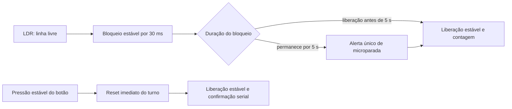

# Contador de Produção Não-Intrusivo

## 1. Identificação do Candidato

- **Nome completo:** Alan Heverton Lima Martins
- **GitHub:** [@alanheverton](https://github.com/alanheverton)
- **Repositório:** [alanheverton/processoseletivoIoT](https://github.com/alanheverton/processoseletivoIoT)
- **Branch da entrega:** [`projeto-light-contador-producao`](https://github.com/alanheverton/processoseletivoIoT/tree/projeto-light-contador-producao)

## 2. Visão Geral da Solução

Este projeto implementa um contador de produção não intrusivo para modernização de linhas industriais manuais ou semiautomáticas que não possuem CLP. A proposta é realizar um *retrofit* de baixo custo: um sensor óptico observa a passagem das peças sem contato mecânico, enquanto o ESP32 contabiliza a produção, calcula o tempo de ciclo e identifica bloqueios prolongados.

Na simulação, o sinal digital do LDR fica em nível alto quando a luz é obstruída. O firmware reconhece uma peça somente após a sequência completa de bloqueio e liberação do sensor, evitando contar repetidamente um objeto que permaneça parado. Se o bloqueio durar pelo menos 5 segundos, uma microparada é informada uma única vez pela UART. O operador pode zerar o turno por meio do botão `RESET`.

## 3. Arquitetura do Sistema Embarcado

O firmware foi organizado na classe `ProductionCounter`, que concentra os estados e separa as responsabilidades em métodos curtos:

- `_update_light()` filtra o sinal óptico e reconhece suas transições estáveis;
- `_start_blockage()` inicia o acompanhamento da peça e o temporizador de bloqueio;
- `_finish_blockage()` conclui a passagem, incrementa a contagem e calcula o ciclo;
- `_check_micro_stop()` emite um único alerta para cada bloqueio prolongado;
- `_update_button()` filtra o botão, aplica o reset no acionamento e confirma o gesto na liberação;
- `_reset_shift()` reinicia contagem e referências temporais;
- `_poll_once()` coordena uma iteração do sistema;
- `run()` mantém o laço cooperativo com intervalo curto entre as leituras.



O pino digital `GPIO34` recebe o sinal `DO` do módulo LDR: `HIGH` representa escuro ou feixe bloqueado, e `LOW` representa luz livre. Cada mudança precisa permanecer estável por `LIGHT_DEBOUNCE_MS = 30` antes de alterar o estado lógico. Na transição para bloqueado, o sistema registra o início da passagem; na liberação estável, conta exatamente uma peça.

O tempo de ciclo é o intervalo, calculado em milissegundos, entre a conclusão atual e a referência anterior. Essa referência é a inicialização para a primeira peça, o último reset para a primeira peça do novo turno ou a conclusão da peça anterior para as demais.

O botão em `GPIO27` utiliza `Pin.PULL_UP`, portanto seu nível ativo é `LOW`. Tanto a pressão quanto a liberação precisam permanecer estáveis por `BUTTON_DEBOUNCE_MS = 40`. Assim que a pressão estável é reconhecida, a contagem e os cronômetros são zerados imediatamente. A mensagem de confirmação é emitida somente após a liberação estável, atendendo ao roteiro da automação sem adiar a alteração de estado. Um sinalizador pendente associa a confirmação ao acionamento anterior, evitando mensagens espúrias caso o sistema inicialize com o botão pressionado e impedindo repetições enquanto ele permanece mantido.

O reset zera a contagem e redefine a referência do próximo ciclo. Caso o sensor continue bloqueado nesse momento, a janela de 5 segundos da microparada também recomeça, permitindo um novo alerta sem reutilizar o tempo acumulado no turno anterior.

O laço principal é cooperativo e executa uma leitura a cada `POLL_INTERVAL_MS = 10`. Não há esperas longas, interrupções ou tarefas concorrentes. Todas as durações são calculadas por `ticks_diff()`, o que mantém as comparações corretas mesmo quando o contador interno de `ticks_ms()` retorna ao início de sua faixa.

## 4. Componentes Utilizados na Simulação

| Componente | Identificador | Conexões principais | Função |
|---|---|---|---|
| ESP32 DevKit C v4 | `esp` | Alimentação e UART | Executa o firmware MicroPython e mantém os estados do sistema |
| Módulo fotorresistor (LDR) | `ldr1` | `VCC` em `3V3`, `GND` em terra e `DO` no `GPIO34` | Detecta linha livre ou bloqueada por comparação digital; limiar simulado de `1,65 V` |
| Botão de pressão | `btn1` | `GPIO27` e terra | Solicita o reset do turno; entrada ativa em nível baixo com *pull-up* interno |
| Monitor serial | UART | `TX`/`RX` do ESP32 | Exibe inicialização, contagem, tempo de ciclo, microparada e confirmação de reset |

O LDR começa configurado com `800 lux`, representando a linha livre. Sua saída analógica `AO` não é utilizada, pois a decisão binária é realizada pelo comparador do próprio módulo e entregue pelo pino `DO`.

## 5. Decisões Técnicas Relevantes

- **Máquina de estados por transições:** a peça é contada na passagem de bloqueado para livre, e não pelo nível instantâneo. Isso assegura uma contagem por objeto completamente liberado.
- **Temporização não bloqueante:** o limite de microparada (`MICRO_STOP_LIMIT_MS = 5000`) é acompanhado no mesmo laço das entradas. Assim, o sistema continua respondendo ao sensor e ao botão durante a espera.
- **Debounce independente:** sensor e botão possuem filtros e constantes próprios (`30 ms` e `40 ms`), adequando a validação à natureza de cada entrada sem espalhar números mágicos pelo código.
- **Alerta rearmável e único:** uma variável registra se a microparada já foi informada. O alerta não inunda a UART durante o mesmo bloqueio e volta a ficar disponível após a liberação ou o reset.
- **Reset imediato com confirmação posterior:** a pressão estável zera o turno no instante do acionamento, conforme o requisito funcional. A liberação estável apenas confirma pela UART o reset já realizado, garantindo uma mensagem por gesto sem repetir a mutação enquanto o botão permanece pressionado.
- **Encapsulamento:** estados mutáveis pertencem a uma instância de `ProductionCounter`; pinos, limiares, intervalos e mensagens são constantes nomeadas. Essa separação deixa explícitas as regras do processo e facilita ajustes.
- **Aritmética temporal segura:** `ticks_diff()` é usado em todas as durações, evitando subtrações diretas que falhariam no retorno periódico do contador do MicroPython.

## 6. Resultados Obtidos

A execução automatizada publicada de referência validou o checkpoint [`dbe5da82e78d610aba30e38ed9585c10f394b683`](https://github.com/alanheverton/processoseletivoIoT/commit/dbe5da82e78d610aba30e38ed9585c10f394b683). Esse [registro no GitHub Actions](https://github.com/alanheverton/processoseletivoIoT/actions/runs/30175040252) terminou com sucesso em **1 min 26 s**; a verificação do commit final ocorre automaticamente a cada novo *push*.

| Verificação | Resultado |
|---|---|
| Detecção do cenário ativo | `light` |
| Build do sistema de arquivos | **PASS** |
| Cenário 1 — passagem e contagem de peça | **PASS** |
| Cenário 2 — bloqueio e alerta de microparada | **PASS** |
| Cenário 3 — acionamento e reset do turno | **PASS** |
| Testes Wokwi | **3/3 aprovados** |
| Artefato `fs.bin` | **2.097.152 bytes** |

Ambiente comprovado na construção e na simulação:

- ESP-IDF `5.2.2`;
- MicroPython `1.24.1-1.g50c8864e7f`;
- Wokwi CLI `0.26.1`.

As mensagens funcionais emitidas pela UART são:

```text
Contador de Producao Inicializado
Peca detectada! Total: X
Tempo de ciclo: N ms
Alerta: Micro-parada detectada!
Turno resetado com sucesso. Contadores zerados.
```

Exemplo consolidado da telemetria observada na simulação:

```text
Contador de Producao Inicializado
Peca detectada! Total: 1
Tempo de ciclo: 1343 ms
Alerta: Micro-parada detectada!
Turno resetado com sucesso. Contadores zerados.
```

O valor de `1343 ms` é uma observação do roteiro simulado, não um *benchmark* de desempenho nem uma estimativa de produtividade da linha real.

O firmware e a geração do sistema de arquivos concluíram sem erros ou *warnings* de compilação. Os registros da execução apresentam avisos externos provenientes das Actions fornecidas e do runtime Node.js, incluindo mensagens de depreciação e migração automática; eles não são produzidos pelo firmware nem pelo processo de build.

## 7. Comentários Adicionais

A principal dificuldade foi coordenar estímulos com durações diferentes sem bloquear o laço: uma passagem pode durar centenas de milissegundos, uma microparada exige acompanhamento por segundos e o botão precisa ser filtrado sem atrasar o sensor. A solução adotou referências temporais independentes e telemetria serial emitida somente nas transições relevantes. Outra decisão importante foi separar o efeito da confirmação: o reset ocorre na pressão filtrada, enquanto a mensagem é adiada até a liberação filtrada, preservando uma única ação por gesto e o contrato esperado pelo consumidor da UART.

Limitações atuais:

- a validação foi realizada em simulação, sem ensaio com sensor e esteira físicos;
- luminosidade ambiente, posicionamento, calibração do limiar e eventual histerese precisam ser avaliados na instalação real;
- um único sensor não identifica direção e pode tratar peças sobrepostas ou sem intervalo como uma única passagem;
- contagem e temporizadores permanecem apenas na RAM e são perdidos após reinicialização ou falta de energia;
- a UART oferece observabilidade local, mas não envia dados pela rede;
- o tempo de ciclo representa o intervalo entre conclusões de peças, e não o tempo durante o qual cada peça permaneceu diante do sensor.

Como evolução, a contagem poderia ser persistida em NVS e a telemetria poderia ser publicada por MQTT. Os dados atuais de contagem, ciclo e microparadas fornecem insumos para disponibilidade e desempenho, mas o cálculo completo de OEE exige também tempo planejado e operacional, duração das paradas, ciclo ideal e classificação de peças boas e rejeitadas. Um segundo sensor óptico também poderia determinar direção, separar eventos ambíguos e melhorar a robustez da detecção.
